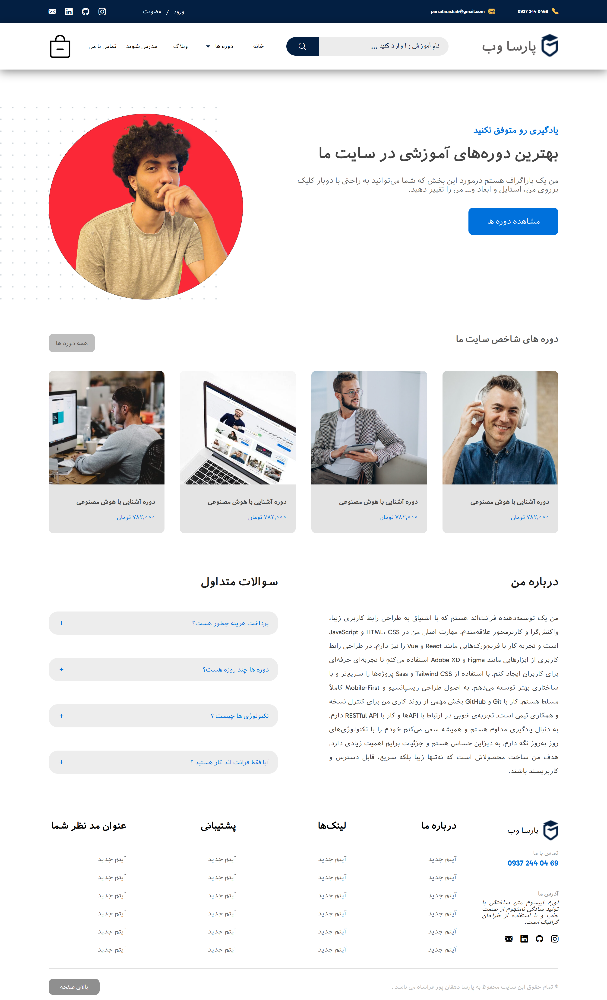

# Frontend Project parsa Web Flex

A simple frontend project developed using HTML and CSS.

## 📅 Created On  
May 30, 2025

## 👨‍💻 Developed By  
Parsa Dehghan Pour Farashah

## 🛠️ Technologies Used  
- HTML  
- CSS  

## 🎯 Role  
Frontend Developer

## 🔗 [Online Demo](https://parsa-farshah.github.io/parsaWebFlex/)

## 📬 How to Reach Me  
- Instagram: [@parsa_dehghanpour_dv](https://www.instagram.com/parsa_dehghanpour_dv?igsh=eHkwNWhsa3I4ZWVp)  
- LinkedIn: [Parsa Dehghan Pour Farashah](https://www.linkedin.com/in/parsa-dehghan-pour-farashah-85ab04250?utm_source=share&utm_campaign=share_via&utm_content=profile&utm_medium=android_app)

